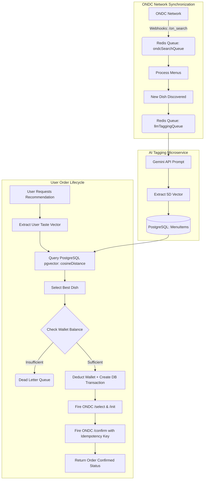

# WoTeaT Backend Flow

This document outlines the background data orchestration, AI tagging, and ONDC ordering pipelines.

## High-Level Flowchart

## Core Backend Microservices

1. **Self-Learning PostgreSQL**: Utilizes the `pgvector` extension and an HNSW index to calculate the `cosineDistance` between the user's dynamic taste vector and thousands of LLM-tagged menu items in milliseconds.
2. **ONDC Background Sync**: ONDC uses asynchronous webhooks. When we search for a restaurant, the network replies seconds later to the `/on_search` endpoint with a massive JSON payload. `BullMQ` buffers this payload in Redis to prevent server overload.
3. **LLM Background Tagging**: Dishes arrive from ONDC as raw text (e.g. "Chicken Tikka"). A dedicated background worker utilizes the Gemini API to mathematically parse this text into a normalized 5-dimensional array and updates the `MenuItem` in PostgreSQL.
4. **Idempotency Engine**: When an order is triggered via `/auto-order`, a unique UUID (Idempotency Key) is wrapped in a strict ACID database transaction along with the wallet deduction. This prevents double-billing even if the network drops during the ONDC `/confirm` call.
