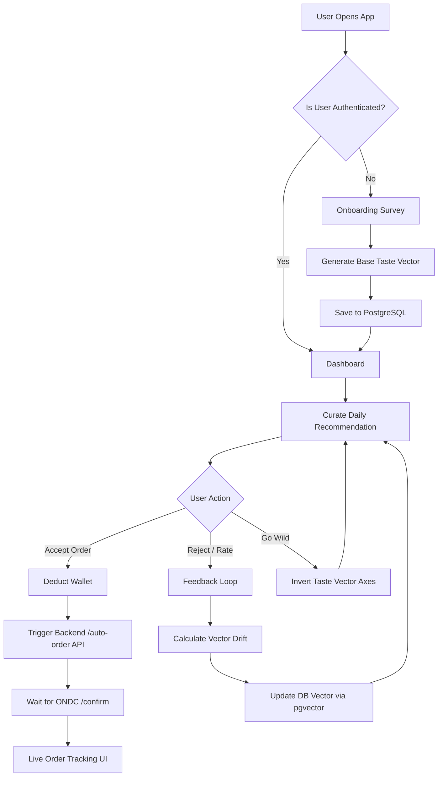

# WoTeaT Frontend Flow

This document details the frontend interaction architecture for the WoTeaT platform.

## High-Level Flowchart

## Detailed Component Lifecycle

1. **Onboarding (`Onboarding.jsx`)**: Collects preferences (e.g. Spice tolerance, Carb preference) and maps them to a `[Spice, Cream, Fry, Tang, Carb]` vector array between `0.0` and `1.0`.
2. **Dashboard (`Dashboard.jsx`)**: The primary orchestration hub. It reads the current vector and requests curated items from the backend. 
3. **Graphics Engine (`Graphics.jsx`)**: Replaces emojis and basic UI elements with scalable SVG cutouts, defining the premium "Soviet-Constructivist" visual identity.
4. **Wallet Ledger (`walletLedger.js`)**: Manages the local state of the user's mock UPI wallet, preventing order triggers if balance is insufficient.
